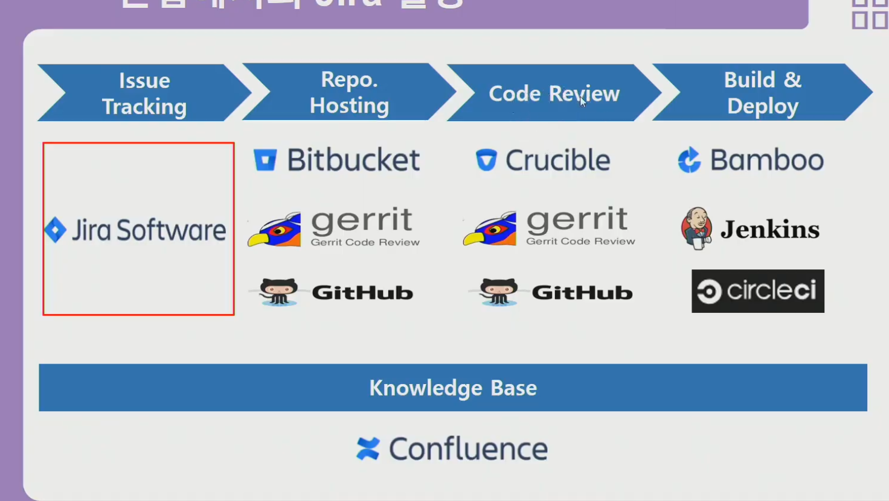

## Jira와 JQL의 활용

### Jira의 목적

- DevOps에서 아래 두 가지 목적을 담당

  

  1. 팀원 모두가 알고 있는 하나의 공유된 지표
  2. 장애나 이슈가 있을 때 팀원들과 공유를 효율적으로 하기 위함

### Jira Guide

**이슈 타입**

- Story : 유저에게 제공해야 할 하나의 스토리 라인 (회원가입, 로그인 등)
- Task : 할 일 하나 하나를 단위로 나눠둠(회원가입 창, 인증, 비밀번호 변경 개발 등등)
- Bug: 버그 발생시
- Epic: 하나의 큰 틀. 위의 모든 것이 섞여들어올 수 있는 하나의 테마. Active 등으로 공유할 때 사용

**이슈 창**

- Status: 현재 진행 상태
- Component/s: 하나의 개발 항목 / 팀 단위 / 이슈타입으로 묶기 힘들때 (eg. frontend / backend)
- Resolution: 이슈가 현재 진행중인지 끝났는지(Unresolved / Done)

- Assignee: 담당자
- Reporter: 생성자

### JQL

- Jira Query Language
- Jira Issue를 구조적으로 검색하기 위해 제공하는 언어
- SQL과 비슷한 문법
- Jira의 각 필드를에 맞는 특수한 예약어들을 제공
- 쌓인 issue들을 재가공해 유의미한 데이터를 도출해 내는데 활용(Gadget, Agile Board 등)

**사용**

- filter 탭에서 **Advanced** 클릭 후 쿼리 직접 작성 가능

**연산자(Operators)**

| 연산자                 | 상세                                              |
| ---------------------- | ------------------------------------------------- |
| =, !=, >, >=           |                                                   |
| in, not in             | 속해있다 / 속해있지 않다                          |
| ~, !~                  | 포함하는 / 포함하지 않는(contains / not contains) |
| is empty, is not empty | 비어있는 / 비어있지 않은                          |
| is null, is not null   |                                                   |
|                        |                                                   |

**Relative Dates**

- 현재 날짜 기준으로 Past, Future의 날짜들이 며칠 전/후인가 예약어로 제공

- -1w = 일주일 전 의미

  사용 예시 `undated > -1d` : 어제 이후에 수정된 이슈들 

**Keywords**

- AND
- OR
- NOT
- EMPTY
- NULL
- ORDER BY [DESC / ASC]

**Functions**

| 함수                                                        | 상세                                  |
| ----------------------------------------------------------- | ------------------------------------- |
| endOfDay() / startOfDay()                                   | 오늘 24시 / 오늘 0시                  |
| endOfWeek() / startOfWeek()                                 | 토요일 / 일요일                       |
| endOfMonth() / startOfMonth() / endOfYear() / startOfYear() |                                       |
| currentLogin()                                              | 가장 최근한 로그인한 이후 수정된 이슈 |
| currentUser()                                               | 현재 사용자                           |

`updated > startOfWeek(2d)` : **일요일 + 2일 = 화요일 이후 수정된 이슈**

### Filter 활용

- 위 키워드들을 이용, 필터로 적용하여 사용 가능

- `Search` 항목에서 `Save as` 버튼 이용 저장 후, 생성된 `Details` 버튼으로 읽기 권한 수정

- 예시

  **나의 미완료 이슈**

  project = <프로젝트명> AND assignee = currentUser() AND resolution = Unresolved

### DASHBOARD & Gadget

**Dashboard**

- System Dashboard : 매니저가 설정한 모든 사용자에게 적용할 Dashboard

- **Manage Dashboard** 통해 나만의 Dashboard 설정이 가능

  **Gadget**을 이용, 대쉬보드에 설정할 가젯들을 넣어줄 수 있음

  **Filter result gadget**를 이용, 내 필터를 적용한 가젯을 대쉬보드에 출력할 수 있음

### Agile Board

- Kanban board : 스프린트라는 개념없이, 필터에 의해 조회된 이슈들을 단계별로 출력하여 보여줌

  Scrum board : 스프린트라는 개념 포함, 스프린트 하나 하나를 생성해 여기에 주기를 설정(보통 2주이내)하여 그 스프린트 내에 모든 이슈들 중 작업할 이슈들을 넣어서 순서대로 진행하는 방식

### 현업에서의 Jira 활용

**Smart Commit**

- Jira와 Gitlab의 커밋을 이어줘서, 커밋할 때 Jira에서 component 등도 자동으로 가능
- 따로 찾아서 추가로 정보를 확인할 것

**Jira plugins**

- 여러가지 플러그인을 내장하고 있는데, 빌드 버젼별 이슈 테스트 결과를 따로 확인이 가능함.