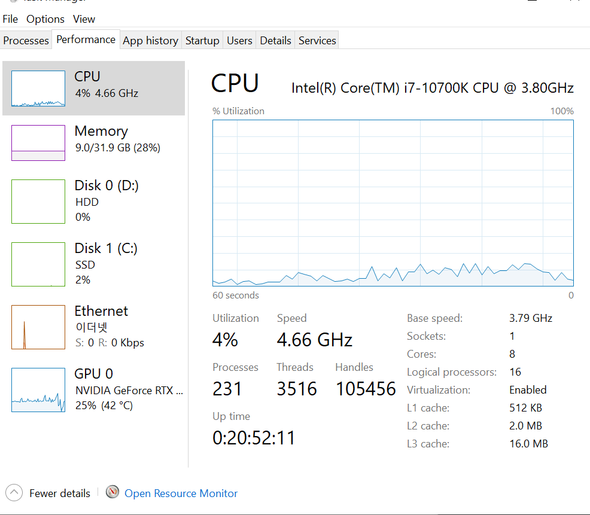
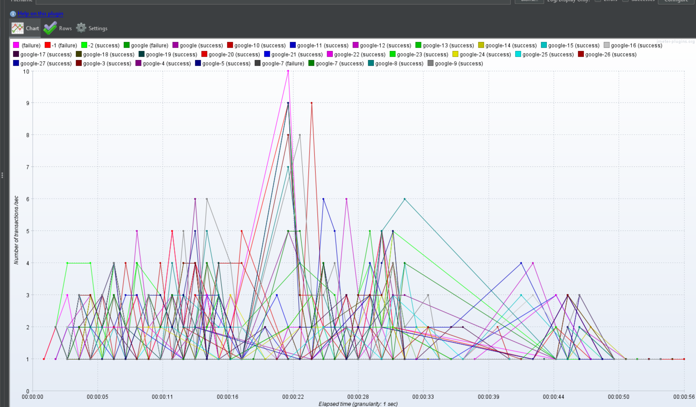
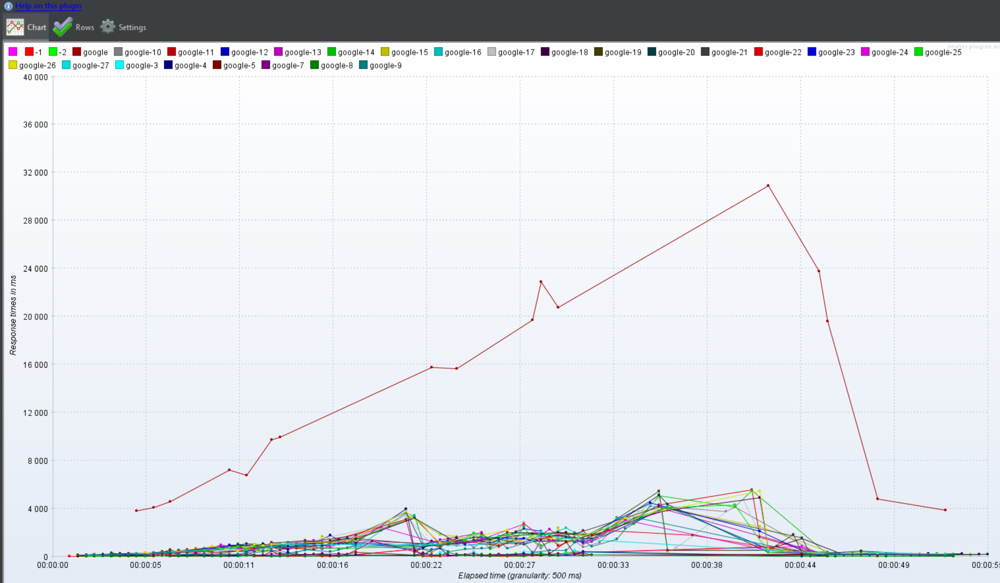
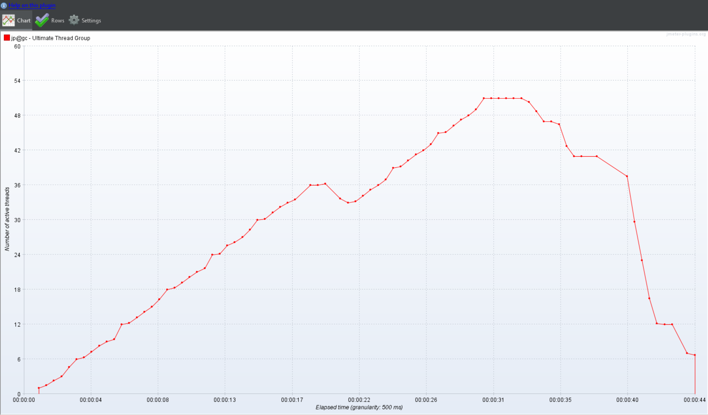

# 산출물

- 대상 시스템의 개략적인 한계 부하(TPS) 측정 결과
  - 한계 부하 당시의 CPU, MEM 점유율(스크린샷)
  - 
  - 한계 부하까지 가지 않았으나, 프로그램이 정상작동하지 않고 엄청난 렉이 걸리고, 인터넷 사용에 제약이 생겨 더 진행이 불가능
    - 일부 접속 failure가 발생했으며, 프로그램에서 어떠한 것이라도 조작시 프로그램이 멈추고 작동하지 않아 더이상의 진행은 불가능하였음.
  - 한계부하 기술
  
- 한계 부하 발생후의 그래프
  - TPS그래프
    - 
  - 응답속도 그래프
    - 
  - 유저 쓰레드 그래프 
    - 

